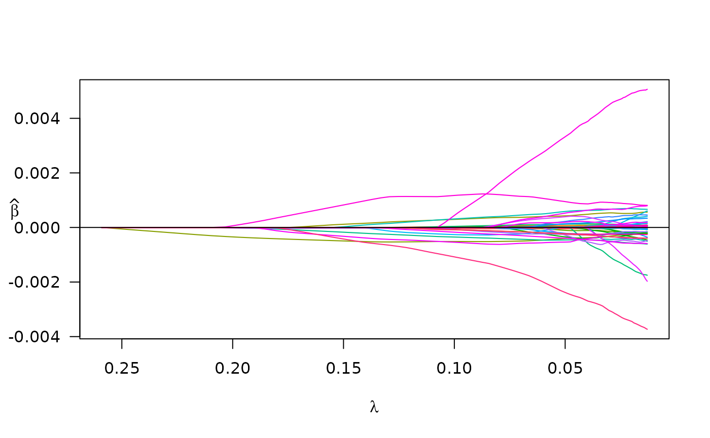

# If your data is in a delimited file

``` r
library(plmmr)
#> Loading required package: bigalgebra
#> Loading required package: bigmemory
```

If you have data stored as a delimited file (e.g., a `.txt` file), this
is the place for you to begin. To analyze such data, there is a 3-step
procedure: (1) process the data, (2) create a design, and (3) fit a
model.

## Process the data

``` r
 # I will create the processed data files in a temporary directory; 
#   fill in the `rds_dir` argument with the directory of your choice
temp_dir <- tempdir()

colon_dat <- process_delim(data_file = "colon2.txt",
  data_dir = find_example_data(parent = TRUE), 
  rds_dir = temp_dir,
  rds_prefix = "processed_colon2",
  sep = "\t",
  overwrite = TRUE,
  header = TRUE)
#> There are 62 observations and 2001 features in the specified data files.
#> At this time, plmmr::process_delim() does not not handle missing values in delimited data.
#>       Please make sure you have addressed missingness before you proceed.
#> 
#> process_plink() completed 
#> Processed files now saved as /tmp/RtmpYWKVrJ/processed_colon2.rds

# look at what is created 
colon <- readRDS(colon_dat)
```

The output messages indicate that the data has been processed. This call
created 2 files, one `.rds` file and a corresponding `.bk` file. The
`.bk` file is a special type of binary file that can be used to store
large data sets. The `.rds` file contains a pointer to the `.bk` file,
along with other meta-data.

Note that what is returned by
[`process_delim()`](https://pbreheny.github.io/plmmr/reference/process_delim.md)
is a character string with a filepath.

## Create a design

Creating a design ensures that data are in a uniform format prior to
analysis. For delimited files, there are two main processes happening in
[`create_design()`](https://pbreheny.github.io/plmmr/reference/create_design.md):
(1) standardization of the columns and (2) the construction of the
penalty factor vector. Standardization of the columns ensures that all
features are evaluated in the model on a uniform scale; this is done by
transforming each column of the design matrix to have a mean of 0 and a
variance of 1. The penalty factor vector is an indicator vector in which
a 0 represents a feature that will always be in the model – such a
feature is *unpenalized*. To specify columns that you want to be
unpenalized, use the ‘unpen’ argument. Below in our example, I am
choosing to make ‘sex’ an unpenalized covariate.

A side note on unpenalized covariates: for delimited file data, all
features that you want to include in the model – both the penalized and
unpenalized features – must be included in your delimited file. This
differs from how PLINK file data are analyzed; look at the
[`create_design()`](https://pbreheny.github.io/plmmr/reference/create_design.md)
documentation details for examples.

``` r
# prepare outcome data
colon_outcome <- read.delim(find_example_data(path = "colon2_outcome.txt"))

# create a design
colon_design <- create_design(data_file = colon_dat,
                              rds_dir = temp_dir,
                              new_file = "std_colon2",
                              add_outcome = colon_outcome,
                              outcome_id = "ID",
                              outcome_col = "y",
                              unpen = "sex", # this will keep 'sex' in the final model
                              logfile = "colon_design")
#> No feature_id supplied; will assume data X are in same row-order as add_outcome.
#> There are 0 constant features in the data
#> Subsetting data to exclude constant features (e.g., monomorphic SNPs)
#> Column-standardizing the design matrix...
#> Standardization completed at 2026-04-17 00:20:27
#> Done with standardization. File formatting in progress
```

As with
[`process_delim()`](https://pbreheny.github.io/plmmr/reference/process_delim.md),
the
[`create_design()`](https://pbreheny.github.io/plmmr/reference/create_design.md)
function returns a filepath: . The output messages document the steps in
the create design procedure, and these messages are saved to the text
file `colon_design.log` in the `rds_dir` folder.

For didactic purposes, we can look at the design:

``` r
# look at the results
colon_rds <- readRDS(colon_design)
str(colon_rds)
#> List of 18
#>  $ X_colnames    : chr [1:2001] "sex" "Hsa.3004" "Hsa.13491" "Hsa.13491.1" ...
#>  $ X_rownames    : chr [1:62] "row1" "row2" "row3" "row4" ...
#>  $ n             : num 62
#>  $ p             : num 2001
#>  $ is_plink      : logi FALSE
#>  $ outcome_idx   : int [1:62] 1 2 3 4 5 6 7 8 9 10 ...
#>  $ y             : int [1:62] 1 0 1 0 1 0 1 0 1 0 ...
#>  $ std_X_rownames: chr [1:62] "row1" "row2" "row3" "row4" ...
#>  $ unpen         : int 1
#>  $ unpen_colnames: chr "sex"
#>  $ ns            : int [1:2001] 1 2 3 4 5 6 7 8 9 10 ...
#>  $ std_X_colnames: chr [1:2001] "sex" "Hsa.3004" "Hsa.13491" "Hsa.13491.1" ...
#>  $ std_X         :Formal class 'big.matrix.descriptor' [package "bigmemory"] with 1 slot
#>   .. ..@ description:List of 13
#>   .. .. ..$ sharedType: chr "FileBacked"
#>   .. .. ..$ filename  : chr "std_colon2.bk"
#>   .. .. ..$ dirname   : chr "/tmp/RtmpYWKVrJ/"
#>   .. .. ..$ totalRows : int 62
#>   .. .. ..$ totalCols : int 2001
#>   .. .. ..$ rowOffset : num [1:2] 0 62
#>   .. .. ..$ colOffset : num [1:2] 0 2001
#>   .. .. ..$ nrow      : num 62
#>   .. .. ..$ ncol      : num 2001
#>   .. .. ..$ rowNames  : NULL
#>   .. .. ..$ colNames  : chr [1:2001] "sex" "Hsa.3004" "Hsa.13491" "Hsa.13491.1" ...
#>   .. .. ..$ type      : chr "double"
#>   .. .. ..$ separated : logi FALSE
#>  $ std_X_n       : num 62
#>  $ std_X_p       : num 2001
#>  $ std_X_center  : num [1:2001] 1.47 7015.79 4966.96 4094.73 3987.79 ...
#>  $ std_X_scale   : num [1:2001] 0.499 3067.926 2171.166 1803.359 2002.738 ...
#>  $ penalty_factor: num [1:2001] 0 1 1 1 1 1 1 1 1 1 ...
#>  - attr(*, "class")= chr "plmm_design"
```

## Fit a model

We fit a model using our design as follows:

``` r
colon_fit <- plmm(design = colon_design, return_fit = TRUE, trace = TRUE)
#> Note: The design matrix is being returned as a file-backed big.matrix object -- see bigmemory::big.matrix() documentation for details.
#> Reminder: the X that is returned here is column-standardized
#> Input data passed all checks at  2026-04-17 00:20:27
#> Starting decomposition.
#> Calculating the eigendecomposition of K
#> Eigendecomposition finished at  2026-04-17 00:20:27
#> Beginning rotation ('preconditioning').
#> Rotation (preconditioning) finished at  2026-04-17 00:20:27
#> Setting up lambda/preparing for model fitting.
#> Beginning model fitting.
#> Model fitting finished at  2026-04-17 00:20:27 
#> Beta values are estimated -- almost done!
#> Formatting results (backtransforming coefs. to original scale).
#> Model ready at  2026-04-17 00:20:27
```

Notice the messages that are printed out – this documentation may be
optionally saved to another `.log` file using the `logfile` argument.

We can examine the results at a specific \lambda value:

``` r
summary(colon_fit, idx = 50)
#> lasso-penalized regression model with n=62, p=2002 at lambda=0.0588
#> -------------------------------------------------
#> The model converged 
#> -------------------------------------------------
#> # of non-zero coefficients:  29 
#> -------------------------------------------------
```

We may also plot of the paths of the estimated coefficients:

``` r
plot(colon_fit)
```



## Prediction for filebacked data

This example shows an experimental option, wherein we are working to add
a prediction method for filebacked outside of cross-validation.

``` r
# linear predictor 
yhat_lp <- predict(object = colon_fit,
        newX = attach.big.matrix(colon$X),
        type = "lp")

# best linear unbiased predictor 
yhat_blup <- predict(object = colon_fit,
        newX = bigmemory::attach.big.matrix(colon$X),
        type = "blup")

# look at mean squared prediction error 
mspe_lp <- apply(yhat_lp, 2, function(c){crossprod(colon_outcome$y - c)/length(c)})
mspe_blup <- apply(yhat_blup, 2, function(c){crossprod(colon_outcome$y - c)/length(c)})
min(mspe_lp)
#> [1] 0.002021684
min(mspe_blup)
#> [1] 0.001304756
```
