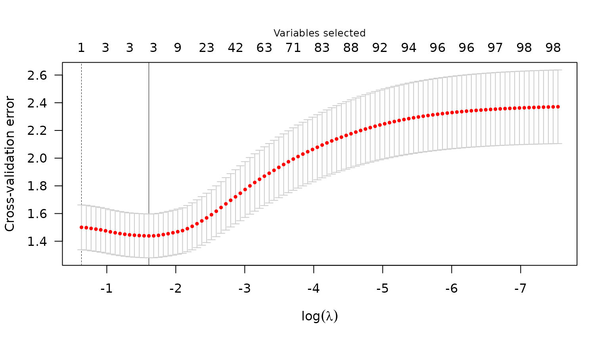
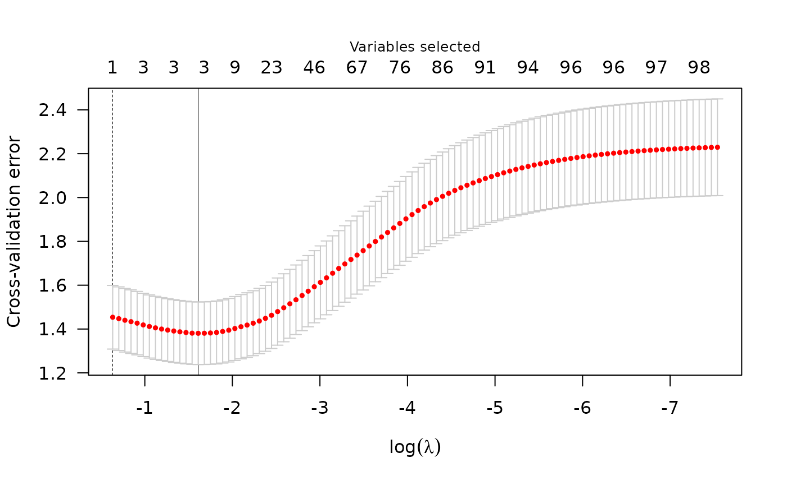

# If your data is in a matrix or data frame

``` r
library(plmmr)
#> Loading required package: bigalgebra
#> Loading required package: bigmemory
```

In this overview, I will provide a demo of the main functions in `plmmr`
using the `admix` data. Checkout the other vignettes to see examples of
analyzing data from PLINK files or delimited files.

Examine what we have in the `admix` data:

``` r
str(admix)
#> List of 3
#>  $ X       : int [1:197, 1:100] 0 0 0 0 1 0 1 0 0 0 ...
#>   ..- attr(*, "dimnames")=List of 2
#>   .. ..$ : NULL
#>   .. ..$ : chr [1:100] "Snp1" "Snp2" "Snp3" "Snp4" ...
#>  $ y       : num [1:197, 1] 3.52 3.754 1.191 0.579 4.085 ...
#>  $ ancestry: num [1:197] 1 1 1 1 1 1 1 1 1 1 ...
```

## Basic model fitting

The `admix` dataset is now ready to analyze with a call to
[`plmmr::plmm()`](https://pbreheny.github.io/plmmr/reference/plmm.md)
(one of the main functions in `plmmr`):

``` r
admix_fit <- plmm(admix$X, admix$y)
summary(admix_fit, lambda = admix_fit$lambda[50])
#> lasso-penalized regression model with n=197, p=101 at lambda=0.01403
#> -------------------------------------------------
#> The model converged 
#> -------------------------------------------------
#> # of non-zero coefficients:  89 
#> -------------------------------------------------
```

Notice: I am passing `admix$X` as the `design` argument in
[`plmm()`](https://pbreheny.github.io/plmmr/reference/plmm.md);
internally,
[`plmm()`](https://pbreheny.github.io/plmmr/reference/plmm.md) has taken
this `X` input and created a `plmm_design` object. You could also supply
`X` and `y` to
[`create_design()`](https://pbreheny.github.io/plmmr/reference/create_design.md)
to make this step explicit.

The returned `beta_vals` item is a matrix whose rows are \hat\beta
coefficients and whose columns represent values of the penalization
parameter \lambda. By default, `plmm` fits 100 values of \lambda (see
the `setup_lambda` function for details).

``` r
admix_fit$beta_vals[1:10, 97:100] |> 
  knitr::kable(digits = 3,
               format = "html")
```

|             | 0.00053 | 0.00049 | 0.00046 | 0.00043 |
|:------------|--------:|--------:|--------:|--------:|
| (Intercept) |   6.919 |   6.920 |   6.920 |   6.921 |
| Snp1        |  -0.853 |  -0.853 |  -0.853 |  -0.853 |
| Snp2        |   0.274 |   0.275 |   0.275 |   0.275 |
| Snp3        |   3.348 |   3.349 |   3.349 |   3.350 |
| Snp4        |   0.191 |   0.191 |   0.191 |   0.191 |
| Snp5        |   0.636 |   0.636 |   0.637 |   0.637 |
| Snp6        |  -0.125 |  -0.125 |  -0.125 |  -0.125 |
| Snp7        |   0.171 |   0.171 |   0.171 |   0.171 |
| Snp8        |   0.000 |   0.000 |   0.000 |   0.000 |
| Snp9        |   0.269 |   0.269 |   0.269 |   0.269 |

Note that for all values of \lambda, SNP 8 has \hat \beta = 0. This is
because SNP 8 is a constant feature, a feature (i.e., a column of
\mathbf{X}) whose values do not vary among the members of this
population.

We can summarize our fit at the nth \lambda value:

``` r
# for n = 25 
summary(admix_fit, lambda = admix_fit$lambda[25])
#> lasso-penalized regression model with n=197, p=101 at lambda=0.08027
#> -------------------------------------------------
#> The model converged 
#> -------------------------------------------------
#> # of non-zero coefficients:  49 
#> -------------------------------------------------
```

We can also plot the path of the fit to see how model coefficients vary
with \lambda:

``` r
plot(admix_fit)
```


Plot of path for model fit

Suppose we also know the ancestry groups with which for each person in
the `admix` data self-identified. We would probably want to include this
in the model as an unpenalized covariate (i.e., we would want ‘ancestry’
to always be in the model). To specify an unpenalized covariate, we need
to use the
[`create_design()`](https://pbreheny.github.io/plmmr/reference/create_design.md)
function prior to calling
[`plmm()`](https://pbreheny.github.io/plmmr/reference/plmm.md). Here is
how that would look:

``` r
# add ancestry to design matrix
X_plus_ancestry <- cbind(admix$ancestry, admix$X)

# adjust column names -- need these for designating 'unpen' argument
colnames(X_plus_ancestry) <- c("ancestry", colnames(admix$X))

# create a design
admix_design2 <- create_design(X = X_plus_ancestry,
                               y = admix$y,
                               # below, I mark ancestry variable as unpenalized
                               # we want ancestry to always be in the model
                               unpen = "ancestry")

# now fit a model 
admix_fit2 <- plmm(design = admix_design2)
```

We may compare the results from the model which includes ‘ancestry’ to
our first model:

``` r
summary(admix_fit2, idx = 25)
#> lasso-penalized regression model with n=197, p=102 at lambda=0.09950
#> -------------------------------------------------
#> The model converged 
#> -------------------------------------------------
#> # of non-zero coefficients:  17 
#> -------------------------------------------------
plot(admix_fit2)
```


## Cross validation

To select a \lambda value, we often use cross validation. Below is an
example of using `cv_plmm` to select a \lambda that minimizes
cross-validation error:

``` r
admix_cv <- cv_plmm(design = admix_design2, return_fit = T)
admix_cv_s <- summary(admix_cv, lambda = "min")
print(admix_cv_s)
#> lasso-penalized model with n=197 and p=102
#> At minimum cross-validation error (lambda=0.1999):
#> -------------------------------------------------
#>   Nonzero coefficients: 3
#>   Cross-validation error (deviance): 1.44
#>   Scale estimate (sigma): 1.199
```

We can also plot the cross-validation error (CVE) versus \lambda (on the
log scale):

``` r
plot(admix_cv)
```



Plot of CVE

### Parallelization

As an option for cross-validation, with data stored in-memory you may
choose to implement CV in parallel using the `cluster` argument in
[`cv_plmm()`](https://pbreheny.github.io/plmmr/reference/cv_plmm.md).
Here is an example of setting up CV in parallel:

``` r
# make a cluster
num_cores <- 5 # just using 5 cores as a laptop-sized example
cl <- parallel::makeCluster(spec = num_cores)
print(cl) # check to see what kind of cluster you've made 
#> socket cluster with 5 nodes on host 'localhost'
cv_fit_parallel <- cv_plmm(design = admix_design2,
                           type = "blup",
                           cluster = cl,
                           return_fit = T,
                           trace = FALSE) 

# note: the results closely correspond to the above
summary(cv_fit_parallel)
#> lasso-penalized model with n=197 and p=102
#> At minimum cross-validation error (lambda=0.1999):
#> -------------------------------------------------
#>   Nonzero coefficients: 3
#>   Cross-validation error (deviance): 1.38
#>   Scale estimate (sigma): 1.175
plot(cv_fit_parallel)
```



## Prediction

Below is an example of the
[`predict()`](https://rdrr.io/r/stats/predict.html) methods for PLMMs:

``` r
# make predictions for select lambda value(s)
y_hat <- predict(object = admix_fit,
                 newX = admix$X,
                 type = "blup",
                 X = admix$X)
```

We can compare these predictions with the predictions we would get from
an intercept-only model using mean squared prediction error (MSPE) –
lower is better:

``` r
# intercept-only (or 'null') model
crossprod(admix$y - mean(admix$y))/length(admix$y)
#>          [,1]
#> [1,] 5.928528

# our model at its best value of lambda
apply(y_hat, 2, function(c){crossprod(admix$y - c)/length(c)}) -> mse
min(mse)
#> [1] 0.6820413
# ^ across all values of lambda, our model has MSPE lower than the null model
```

We see our model has better predictions than the null.
