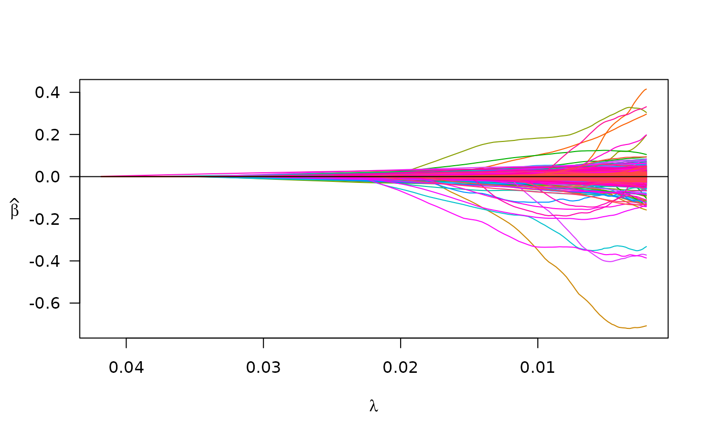
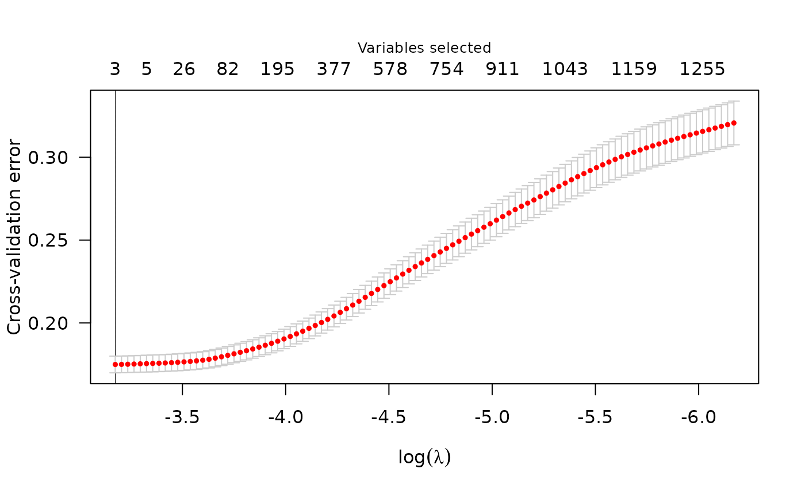

# If your data is in PLINK files

``` r
library(plmmr)
#> Loading required package: bigalgebra
#> Loading required package: bigmemory
```

A widely-used format for storing data from genome-wide association
studies (GWAS) is the [PLINK file
formats](https://www.cog-genomics.org/plink/1.9/formats), which consists
of a triplet of ‘.bed’, ‘.bed’, and ‘.fam’ files. The `plmmr` package is
equipped to analyze data from PLINK files. If you have data in this
format, keep reading – if you want to know more about what each of these
files contains, see [this other
tutorial](https://pbreheny.github.io/adv-gwas-tutorial/quality_control.html)
or the [PLINK documentation](https://www.cog-genomics.org/plink/1.9). If
your data is in delimited files (e.g., `.txt`, `.csv`, etc.), read the
article on analyzing data from delimited files at
`vignette("delim_files", package = "plmmr")`.

The `plmmr` package is designed to handle data so that users can analyze
large data sets. For this reason, data must be preprocessed into a
specific format. There are two steps to prepare for analysis: (1)
process the data and (2) create a design. Processing the data means that
we take the feature data and create a ‘.rds’ object that contains your
feature data in a format compatible with the `bigmemory`
[package](https://cran.r-project.org/web/packages/bigmemory/index.html).
Creating a design involves standardizing the input of the features,
outcome, and penalty factor into the modeling functions
[`plmm()`](https://pbreheny.github.io/plmmr/reference/plmm.md) and
[`cv_plmm()`](https://pbreheny.github.io/plmmr/reference/cv_plmm.md).

## Processing PLINK files

First, unzip your PLINK files if they are zipped. Our example data,
`penncath_lite` data that ships with `plmmr` is zipped; you can run this
command to unzip:

``` r
temp_dir <- tempdir() # using a temp dir -- change to fit your preference
unzip_example_data(outdir = temp_dir)
#> Unzipped files are saved in /tmp/RtmpL0oruW
```

For GWAS data, we have to tell `plmmr` how to combine information across
all three PLINK files (the `.bed`, `.bim`, and `.fam` files). We do this
with
[`process_plink()`](https://pbreheny.github.io/plmmr/reference/process_plink.md).

Here, we will create the files we want in a temporary directory just for
the sake of example. Users can specify the folder of their choice for
`rds_dir`, as shown below:

``` r
# temp_dir <- tempdir() # using a temporary directory (if you didn't already create one above)
plink_data <- process_plink(data_dir = temp_dir, 
                            data_prefix = "penncath_lite",
                            rds_dir = temp_dir,
                            rds_prefix = "imputed_penncath_lite",
                            # imputing the mode to address missing values
                            impute_method = "mode",
                            # overwrite existing files in temp_dir
                            # (you can turn this feature off if you need to)
                            overwrite = TRUE,
                            # turning off parallelization - 
                            #   leaving this on causes problems knitting this vignette
                            parallel = FALSE)
#> 
#> Preprocessing penncath_lite data:
#> Creating penncath_lite.rds
#> 
#> There are 1401 observations and 4367 genomic features in the specified data files, representing chromosomes 1 - 22 
#> There are a total of 3514 SNPs with missing values
#> Of these, 13 are missing in at least 50% of the samples
#> 
#> Imputing the missing (genotype) values using mode method
#> 
#> process_plink() completed
#> Processed files now saved as /tmp/RtmpL0oruW/imputed_penncath_lite.rds
```

You’ll see a lot of messages printed to the console here … the result of
all this is the creation of 3 files: `imputed_penncath_lite.rds` and
`imputed_penncath_lite.bk` contain the data. [¹](#fn1) These will show
up in the folder where the PLINK data is. What is returned is a
filepath. The `.rds` object at this filepath contains the processed
data, which we will now use to create our design.

For didactic purposes, let’s examine what’s in
`imputed_penncath_lite.rds` using the
[`readRDS()`](https://rdrr.io/r/base/readRDS.html) function (**Note:**
Don’t do this in your analysis - the section below reads the data into
memory. This is just for illustration):

``` r
pen <- readRDS(plink_data) # notice: this is a `processed_plink` object 
str(pen) # note: genotype data is *not* in memory
#> List of 5
#>  $ X  :Formal class 'big.matrix.descriptor' [package "bigmemory"] with 1 slot
#>   .. ..@ description:List of 13
#>   .. .. ..$ sharedType: chr "FileBacked"
#>   .. .. ..$ filename  : chr "processed_penncath_lite.bk"
#>   .. .. ..$ dirname   : chr "/tmp/RtmpL0oruW/"
#>   .. .. ..$ totalRows : int 1401
#>   .. .. ..$ totalCols : int 4367
#>   .. .. ..$ rowOffset : num [1:2] 0 1401
#>   .. .. ..$ colOffset : num [1:2] 0 4367
#>   .. .. ..$ nrow      : num 1401
#>   .. .. ..$ ncol      : num 4367
#>   .. .. ..$ rowNames  : NULL
#>   .. .. ..$ colNames  : NULL
#>   .. .. ..$ type      : chr "double"
#>   .. .. ..$ separated : logi FALSE
#>  $ map:'data.frame': 4367 obs. of  6 variables:
#>   ..$ chromosome  : int [1:4367] 1 1 1 1 1 1 1 1 1 1 ...
#>   ..$ marker.ID   : chr [1:4367] "rs3107153" "rs2455124" "rs10915476" "rs4592237" ...
#>   ..$ genetic.dist: int [1:4367] 0 0 0 0 0 0 0 0 0 0 ...
#>   ..$ physical.pos: int [1:4367] 2056735 3188505 4275291 4280630 4286036 4302161 4364564 4388885 4606471 4643688 ...
#>   ..$ allele1     : chr [1:4367] "C" "T" "T" "G" ...
#>   ..$ allele2     : chr [1:4367] "T" "C" "C" "A" ...
#>  $ fam:'data.frame': 1401 obs. of  6 variables:
#>   ..$ family.ID  : int [1:1401] 10002 10004 10005 10007 10008 10009 10010 10011 10012 10013 ...
#>   ..$ sample.ID  : int [1:1401] 1 1 1 1 1 1 1 1 1 1 ...
#>   ..$ paternal.ID: int [1:1401] 0 0 0 0 0 0 0 0 0 0 ...
#>   ..$ maternal.ID: int [1:1401] 0 0 0 0 0 0 0 0 0 0 ...
#>   ..$ sex        : int [1:1401] 1 2 1 1 1 1 1 2 1 2 ...
#>   ..$ affection  : int [1:1401] 1 1 2 1 2 2 2 1 2 -9 ...
#>  $ n  : int 1401
#>  $ p  : int 4367
#>  - attr(*, "class")= chr "processed_plink"
# notice: no more missing values in X
any(is.na(pen$genotypes[,]))
#> [1] FALSE
```

## Creating a design

Now we are ready to create a `plmm_design`, which is an object with the
pieces we need for our model: a design matrix \mathbf{X}, an outcome
vector \mathbf{y}, and a the vector with the penalty factor indicators
(1 = feature will be penalized, 0 = feature will not be penalized).

As a side note: in GWAS studies, it is typical to include some
non-genomic factors as unpenalized covariates as part of the model. For
instance, you may want to adjust for sex or age (as shown in the example
below) – these are factors that you want to ensure are always included
in the selected model. The `plmmr` package allows you to include these
additional unpenalized predictors via the ‘add_predictor’ and
‘predictor_id’ options, both of which are passed through
[`create_design()`](https://pbreheny.github.io/plmmr/reference/create_design.md)
to the internal function
[`create_design_filebacked()`](https://pbreheny.github.io/plmmr/reference/create_design_filebacked.md).
An example with these options is included in the
[`create_design()`](https://pbreheny.github.io/plmmr/reference/create_design.md)
documentation.

``` r
# get outcome data 
penncath_pheno <- read.csv(find_example_data(path = 'penncath_clinical.csv'))

phen <- data.frame(FamID = as.character(penncath_pheno$FamID),
                   CAD = penncath_pheno$CAD)

# prepare a data.frame of the predictors for which we want to adjust: 
other_predictors <- penncath_pheno[,c('FamID', 'sex', 'age')]
other_predictors$FamID <- as.character(other_predictors$FamID)

pen_design <- create_design(data_file = plink_data,
                            feature_id = "FID",
                            rds_dir = temp_dir,
                            new_file = "std_penncath_lite",
                            add_outcome = phen,
                            outcome_id = "FamID",
                            outcome_col = "CAD",
                            add_predictor = other_predictors,
                            predictor_id = 'FamID',
                            logfile = "design",
                            # again, overwrite if needed; use with caution
                            overwrite = TRUE)
#> 
#> Aligning external data with the feature data by FamID 
#> Adding predictors from external data.
#> Aligning IDs between fam and predictor files
#> Column-wise combining data sets
#>   |                                                                              |                                                                      |   0%  |                                                                              |                                                                      |   1%  |                                                                              |=                                                                     |   1%  |                                                                              |=                                                                     |   2%  |                                                                              |==                                                                    |   2%  |                                                                              |==                                                                    |   3%  |                                                                              |==                                                                    |   4%  |                                                                              |===                                                                   |   4%  |                                                                              |===                                                                   |   5%  |                                                                              |====                                                                  |   5%  |                                                                              |====                                                                  |   6%  |                                                                              |=====                                                                 |   6%  |                                                                              |=====                                                                 |   7%  |                                                                              |=====                                                                 |   8%  |                                                                              |======                                                                |   8%  |                                                                              |======                                                                |   9%  |                                                                              |=======                                                               |   9%  |                                                                              |=======                                                               |  10%  |                                                                              |=======                                                               |  11%  |                                                                              |========                                                              |  11%  |                                                                              |========                                                              |  12%  |                                                                              |=========                                                             |  12%  |                                                                              |=========                                                             |  13%  |                                                                              |=========                                                             |  14%  |                                                                              |==========                                                            |  14%  |                                                                              |==========                                                            |  15%  |                                                                              |===========                                                           |  15%  |                                                                              |===========                                                           |  16%  |                                                                              |============                                                          |  16%  |                                                                              |============                                                          |  17%  |                                                                              |============                                                          |  18%  |                                                                              |=============                                                         |  18%  |                                                                              |=============                                                         |  19%  |                                                                              |==============                                                        |  19%  |                                                                              |==============                                                        |  20%  |                                                                              |==============                                                        |  21%  |                                                                              |===============                                                       |  21%  |                                                                              |===============                                                       |  22%  |                                                                              |================                                                      |  22%  |                                                                              |================                                                      |  23%  |                                                                              |================                                                      |  24%  |                                                                              |=================                                                     |  24%  |                                                                              |=================                                                     |  25%  |                                                                              |==================                                                    |  25%  |                                                                              |==================                                                    |  26%  |                                                                              |===================                                                   |  26%  |                                                                              |===================                                                   |  27%  |                                                                              |===================                                                   |  28%  |                                                                              |====================                                                  |  28%  |                                                                              |====================                                                  |  29%  |                                                                              |=====================                                                 |  29%  |                                                                              |=====================                                                 |  30%  |                                                                              |=====================                                                 |  31%  |                                                                              |======================                                                |  31%  |                                                                              |======================                                                |  32%  |                                                                              |=======================                                               |  32%  |                                                                              |=======================                                               |  33%  |                                                                              |=======================                                               |  34%  |                                                                              |========================                                              |  34%  |                                                                              |========================                                              |  35%  |                                                                              |=========================                                             |  35%  |                                                                              |=========================                                             |  36%  |                                                                              |==========================                                            |  36%  |                                                                              |==========================                                            |  37%  |                                                                              |==========================                                            |  38%  |                                                                              |===========================                                           |  38%  |                                                                              |===========================                                           |  39%  |                                                                              |============================                                          |  39%  |                                                                              |============================                                          |  40%  |                                                                              |============================                                          |  41%  |                                                                              |=============================                                         |  41%  |                                                                              |=============================                                         |  42%  |                                                                              |==============================                                        |  42%  |                                                                              |==============================                                        |  43%  |                                                                              |==============================                                        |  44%  |                                                                              |===============================                                       |  44%  |                                                                              |===============================                                       |  45%  |                                                                              |================================                                      |  45%  |                                                                              |================================                                      |  46%  |                                                                              |=================================                                     |  46%  |                                                                              |=================================                                     |  47%  |                                                                              |=================================                                     |  48%  |                                                                              |==================================                                    |  48%  |                                                                              |==================================                                    |  49%  |                                                                              |===================================                                   |  49%  |                                                                              |===================================                                   |  50%  |                                                                              |===================================                                   |  51%  |                                                                              |====================================                                  |  51%  |                                                                              |====================================                                  |  52%  |                                                                              |=====================================                                 |  52%  |                                                                              |=====================================                                 |  53%  |                                                                              |=====================================                                 |  54%  |                                                                              |======================================                                |  54%  |                                                                              |======================================                                |  55%  |                                                                              |=======================================                               |  55%  |                                                                              |=======================================                               |  56%  |                                                                              |========================================                              |  56%  |                                                                              |========================================                              |  57%  |                                                                              |========================================                              |  58%  |                                                                              |=========================================                             |  58%  |                                                                              |=========================================                             |  59%  |                                                                              |==========================================                            |  59%  |                                                                              |==========================================                            |  60%  |                                                                              |==========================================                            |  61%  |                                                                              |===========================================                           |  61%  |                                                                              |===========================================                           |  62%  |                                                                              |============================================                          |  62%  |                                                                              |============================================                          |  63%  |                                                                              |============================================                          |  64%  |                                                                              |=============================================                         |  64%  |                                                                              |=============================================                         |  65%  |                                                                              |==============================================                        |  65%  |                                                                              |==============================================                        |  66%  |                                                                              |===============================================                       |  66%  |                                                                              |===============================================                       |  67%  |                                                                              |===============================================                       |  68%  |                                                                              |================================================                      |  68%  |                                                                              |================================================                      |  69%  |                                                                              |=================================================                     |  69%  |                                                                              |=================================================                     |  70%  |                                                                              |=================================================                     |  71%  |                                                                              |==================================================                    |  71%  |                                                                              |==================================================                    |  72%  |                                                                              |===================================================                   |  72%  |                                                                              |===================================================                   |  73%  |                                                                              |===================================================                   |  74%  |                                                                              |====================================================                  |  74%  |                                                                              |====================================================                  |  75%  |                                                                              |=====================================================                 |  75%  |                                                                              |=====================================================                 |  76%  |                                                                              |======================================================                |  76%  |                                                                              |======================================================                |  77%  |                                                                              |======================================================                |  78%  |                                                                              |=======================================================               |  78%  |                                                                              |=======================================================               |  79%  |                                                                              |========================================================              |  79%  |                                                                              |========================================================              |  80%  |                                                                              |========================================================              |  81%  |                                                                              |=========================================================             |  81%  |                                                                              |=========================================================             |  82%  |                                                                              |==========================================================            |  82%  |                                                                              |==========================================================            |  83%  |                                                                              |==========================================================            |  84%  |                                                                              |===========================================================           |  84%  |                                                                              |===========================================================           |  85%  |                                                                              |============================================================          |  85%  |                                                                              |============================================================          |  86%  |                                                                              |=============================================================         |  86%  |                                                                              |=============================================================         |  87%  |                                                                              |=============================================================         |  88%  |                                                                              |==============================================================        |  88%  |                                                                              |==============================================================        |  89%  |                                                                              |===============================================================       |  89%  |                                                                              |===============================================================       |  90%  |                                                                              |===============================================================       |  91%  |                                                                              |================================================================      |  91%  |                                                                              |================================================================      |  92%  |                                                                              |=================================================================     |  92%  |                                                                              |=================================================================     |  93%  |                                                                              |=================================================================     |  94%  |                                                                              |==================================================================    |  94%  |                                                                              |==================================================================    |  95%  |                                                                              |===================================================================   |  95%  |                                                                              |===================================================================   |  96%  |                                                                              |====================================================================  |  96%  |                                                                              |====================================================================  |  97%  |                                                                              |====================================================================  |  98%  |                                                                              |===================================================================== |  98%  |                                                                              |===================================================================== |  99%  |                                                                              |======================================================================|  99%  |                                                                              |======================================================================| 100%
#> There are 62 constant features in the data
#> Subsetting data to exclude constant features (e.g., monomorphic SNPs)
#> Column-standardizing the design matrix...
#> Standardization completed at 2026-04-14 18:23:30
#> Done with standardization. File formatting in progress

# examine the design - notice the components of this object 
pen_design_rds <- readRDS(pen_design)
str(pen_design_rds)
#> List of 18
#>  $ X_colnames    : chr [1:4367] "rs3107153" "rs2455124" "rs10915476" "rs4592237" ...
#>  $ X_rownames    : chr [1:1401] "10002" "10004" "10005" "10007" ...
#>  $ n             : int 1401
#>  $ p             : int 4367
#>  $ is_plink      : logi TRUE
#>  $ outcome_idx   : int [1:1401] 1 2 3 4 5 6 7 8 9 10 ...
#>  $ y             : Named int [1:1401] 1 1 1 1 1 1 1 1 1 0 ...
#>   ..- attr(*, "names")= chr [1:1401] "CAD1" "CAD2" "CAD3" "CAD4" ...
#>  $ std_X_rownames: chr [1:1401] "10002" "10004" "10005" "10007" ...
#>  $ unpen         : int [1:2] 1 2
#>  $ unpen_colnames: chr [1:2] "sex" "age"
#>  $ ns            : int [1:4307] 1 2 3 4 5 6 7 8 9 10 ...
#>  $ std_X_colnames: chr [1:4307] "sex" "age" "rs3107153" "rs2455124" ...
#>  $ std_X         :Formal class 'big.matrix.descriptor' [package "bigmemory"] with 1 slot
#>   .. ..@ description:List of 13
#>   .. .. ..$ sharedType: chr "FileBacked"
#>   .. .. ..$ filename  : chr "std_penncath_lite.bk"
#>   .. .. ..$ dirname   : chr "/tmp/RtmpL0oruW/"
#>   .. .. ..$ totalRows : int 1401
#>   .. .. ..$ totalCols : int 4307
#>   .. .. ..$ rowOffset : num [1:2] 0 1401
#>   .. .. ..$ colOffset : num [1:2] 0 4307
#>   .. .. ..$ nrow      : num 1401
#>   .. .. ..$ ncol      : num 4307
#>   .. .. ..$ rowNames  : NULL
#>   .. .. ..$ colNames  : NULL
#>   .. .. ..$ type      : chr "double"
#>   .. .. ..$ separated : logi FALSE
#>  $ std_X_n       : num 1401
#>  $ std_X_p       : num 4307
#>  $ std_X_center  : num [1:4307] 1.33119 55.72448 0.00785 0.35974 1.01213 ...
#>  $ std_X_scale   : num [1:4307] 0.4706 9.3341 0.0883 0.7783 0.8636 ...
#>  $ penalty_factor: num [1:4307] 0 0 1 1 1 1 1 1 1 1 ...
#>  - attr(*, "class")= chr "plmm_design"
```

A key part of what
[`create_design()`](https://pbreheny.github.io/plmmr/reference/create_design.md)
is doing is standardizing the columns of the genotype matrix. Below is a
didactic example showing that the columns of the `std_X` element in our
design have mean = 0 and variance = 1. **Note again** that this is not
something you should do in your analysis – this reads the data into
memory.

``` r
# we can check to see that our data have been standardized 
std_X <- attach.big.matrix(pen_design_rds$std_X)
colMeans(std_X[,]) |> summary() # columns have mean zero...
#>       Min.    1st Qu.     Median       Mean    3rd Qu.       Max. 
#> -1.356e-16 -2.336e-17  3.814e-19  1.006e-18  2.524e-17  2.635e-16
apply(std_X[,], 2, var) |> summary() # ... & variance 1
#>    Min. 1st Qu.  Median    Mean 3rd Qu.    Max. 
#>   1.001   1.001   1.001   1.001   1.001   1.001
```

## Fitting a model

Now that we have a design object, we are ready to fit a model. By
default, the model fitting results are saved as files in the folder
specified in the `rds_dir` argument of `plmmm`. If you want to return
the model fitting results, set `return_fit = TRUE` in
[`plmm()`](https://pbreheny.github.io/plmmr/reference/plmm.md).

``` r
pen_fit <- plmm(design = pen_design,
                trace = T,
                return_fit = T)
#> Note: The design matrix is being returned as a file-backed big.matrix object -- see bigmemory::big.matrix() documentation for details.
#> Reminder: the X that is returned here is column-standardized
#> Input data passed all checks at  2026-04-14 18:23:31
#> Starting decomposition.
#> Calculating the eigendecomposition of K
#> Eigendecomposition finished at  2026-04-14 18:23:33
#> Beginning rotation ('preconditioning').
#> Rotation (preconditioning) finished at  2026-04-14 18:23:33
#> Setting up lambda/preparing for model fitting.
#> Beginning model fitting.
#> Model fitting finished at  2026-04-14 18:23:37 
#> Beta values are estimated -- almost done!
#> Formatting results (backtransforming coefs. to original scale).
#> Model ready at  2026-04-14 18:23:37
# you can turn off the trace messages by letting trace = F (default)
```

We examine our model results below:

``` r
summary(pen_fit, idx = 50)
#> lasso-penalized regression model with n=1401, p=4370 at lambda=0.00949
#> -------------------------------------------------
#> The model converged 
#> -------------------------------------------------
#> # of non-zero coefficients:  681 
#> -------------------------------------------------
plot(pen_fit)
```



## Cross validation

To choose a tuning parameter for a model, `plmmr` offers a cross
validation method:

``` r
cv_fit <- cv_plmm(design = pen_design,
                  type = "blup",
                  return_fit = T,
                  trace = T)
#> Note: The design matrix is being returned as a file-backed big.matrix object -- see bigmemory::big.matrix() documentation for details.
#> Reminder: the X that is returned here is column-standardized
#> Starting decomposition.
#> Calculating the eigendecomposition of K
#> Beginning rotation ('preconditioning').
#> Rotation (preconditioning) finished at  2026-04-14 18:23:39
#> Setting up lambda/preparing for model fitting.
#> Beginning model fitting.
#> Model fitting finished at  2026-04-14 18:23:42 
#> 'Fold' argument is either NULL or missing; assigning folds randomly (by default).
#>           
#> To specify folds for each observation, supply a vector with fold assignments.
#> 
#> Starting cross validation
#> Beginning eigendecomposition in fold  1 :
#> Starting decomposition.
#> Calculating the eigendecomposition of K
#> ** Fitting model in fold 1
#> Beginning rotation ('preconditioning').
#> Rotation (preconditioning) finished at  2026-04-14 18:23:43
#> Beginning model fitting.
#> Model fitting finished at  2026-04-14 18:23:46 
#> Beginning eigendecomposition in fold  2 :
#> Starting decomposition.
#> Calculating the eigendecomposition of K
#> ** Fitting model in fold 2
#> Beginning rotation ('preconditioning').
#> Rotation (preconditioning) finished at  2026-04-14 18:23:47
#> Beginning model fitting.
#> Model fitting finished at  2026-04-14 18:23:50 
#> Beginning eigendecomposition in fold  3 :
#> Starting decomposition.
#> Calculating the eigendecomposition of K
#> ** Fitting model in fold 3
#> Beginning rotation ('preconditioning').
#> Rotation (preconditioning) finished at  2026-04-14 18:23:51
#> Beginning model fitting.
#> Model fitting finished at  2026-04-14 18:23:54 
#> Beginning eigendecomposition in fold  4 :
#> Starting decomposition.
#> Calculating the eigendecomposition of K
#> ** Fitting model in fold 4
#> Beginning rotation ('preconditioning').
#> Rotation (preconditioning) finished at  2026-04-14 18:23:55
#> Beginning model fitting.
#> Model fitting finished at  2026-04-14 18:23:58 
#> Beginning eigendecomposition in fold  5 :
#> Starting decomposition.
#> Calculating the eigendecomposition of K
#> ** Fitting model in fold 5
#> Beginning rotation ('preconditioning').
#> Rotation (preconditioning) finished at  2026-04-14 18:23:59
#> Beginning model fitting.
#> Model fitting finished at  2026-04-14 18:24:01
```

There are plot and summary methods for CV models as well:

``` r
summary(cv_fit) # summary at lambda value that minimizes CV error
#> lasso-penalized model with n=1401 and p=4370
#> At minimum cross-validation error (lambda=0.0418):
#> -------------------------------------------------
#>   Nonzero coefficients: 3
#>   Cross-validation error (deviance): 0.17
#>   Scale estimate (sigma): 0.418
plot(cv_fit)
```



## Details: `create_design()` for PLINK data

The call to
[`create_design()`](https://pbreheny.github.io/plmmr/reference/create_design.md)
involves these steps:

- Integrate in the external phenotype information, if supplied. **Note:
  Any samples in the PLINK data that do not have a phenotype value in
  the specified additional phenotype file will be removed from the
  analysis.**

- Identify missing values in both samples and SNPs/features.

- Impute missing values per user’s specified method. See [R
  documentation for
  `bigsnpr::snp_fastImputeSimple()`](https://privefl.github.io/bigsnpr/reference/snp_fastImputeSimple.html)
  for more details. **Note: the plmmr package cannot fit models if
  datasets have missing values.** All missing values must be imputed or
  subset out before analysis.

- Integrate in the external predictor information, if supplied. This
  could be a matrix of meta-data (e.g., age, principal components,
  etc.). **Note:** If there are samples in the supplied file that are
  not included in the PLINK data, these will be removed. For example, if
  you have more phenotyped participants than genotyped participants in
  your study,
  [`plmmr::create_design()`](https://pbreheny.github.io/plmmr/reference/create_design.md)
  will create a matrix of data representing all the *genotyped* samples
  that also have data in the supplied external phenotype file.

- Create a design matrix that represents the nonsingular features and
  the samples that have predictor and phenotype information available
  (in the case where external data are supplied).

- Standardize the design matrix so that all columns have mean of 0 and
  variance of 1.

------------------------------------------------------------------------

1.  Optionally, you can add a `.log` file via the `logfile` argument: a
    log file is a text file documenting the steps that were just done.
